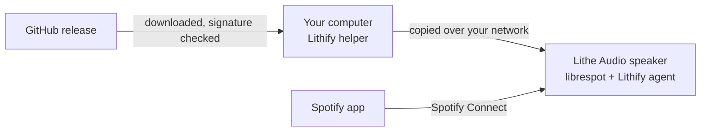

<div align="center">

<picture>
  <source media="(prefers-color-scheme: dark)" srcset="docs/images/logo-dark.svg">
  
</picture>

**Spotify Connect for Lithe Audio Wi-Fi speakers, built on librespot.**

[](https://github.com/OWNER/lithify/releases/latest)
[](https://github.com/OWNER/lithify/actions/workflows/ci.yml)
[](LICENSE)

[Install](#install) · [Limitations](#limitations-and-risks) · [FAQ](#faq) · [Documentation](#documentation) · [Po polsku](docs/pl/README.md)

</div>

Lithify installs [librespot](https://github.com/librespot-org/librespot), an open-source Spotify
Connect client, on Lithe Audio ceiling speakers. It runs next to the speaker's own software: the
firmware is not replaced, and Google Cast, AirPlay and the built-in Spotify keep working. You
install it from a Windows, macOS or Linux computer on the same network.

<picture>
  <source media="(prefers-color-scheme: dark)" srcset="docs/images/speaker-page-dark.png">
  
</picture>

## Why

The Spotify client built into Lithe Audio's LS9 speakers dates from 2021, and the last firmware
update came out in 2024. On our speakers it often started a song and then played nothing, reacted
late to pause and skip, and once kept a processor core busy for days. librespot is maintained and
updated every few weeks; Lithify puts it on the speaker and keeps it up to date.

## Features

- **A second Spotify device on each speaker**, running librespot, built for the speaker's
  processor.
- **The speaker's own volume.** The Spotify slider moves the same volume as Google Cast and AirPlay.
- **A web page on each speaker** at `http://<speaker>:8090`, in English and Polish: status,
  settings, connection tests, logs, updates and rollback.
- **Updates with one button** on that page, or by running the installer again. If a new version
  misbehaves, the previous one is one click away.
- **A watchdog for the built-in Spotify.** It restarts it when it hangs or crashes, and stops
  librespot when Cast, AirPlay or Bluetooth start playing.

## Install

You need:

- a supported speaker, see [Supported speakers](#supported-speakers);
- **Spotify Premium**, because librespot does not work with free accounts;
- a computer on the same network as the speaker: Windows 10 or 11, macOS, or Linux.

**Windows:** download [**Lithify-Windows.cmd**](https://github.com/OWNER/lithify/releases/latest/download/Lithify-Windows.cmd) and double-click it.

**macOS:** open Terminal and run:

```sh
curl -fsSL https://raw.githubusercontent.com/OWNER/lithify/main/installer/install.sh | sh
```

**Linux:** in a terminal, run:

```sh
wget -qO- https://raw.githubusercontent.com/OWNER/lithify/main/installer/install.sh | sh
```

What happens next:

1. The installer lists what it will add to the computer and asks once before it starts.
2. It opens the Lithify wizard in your browser. The wizard finds the speaker on its own.
3. You click **Install**. This usually takes a few minutes, and the speaker is silent for about a
   minute while it restarts.

If the computer cannot download a ready-made release, the installer builds Lithify itself. That
needs Docker and about 4 GB of free memory, and the first build takes up to an hour.

<picture>
  <source media="(prefers-color-scheme: dark)" srcset="docs/images/wizard-dark.png">
  
</picture>

**Check that it works:** open Spotify on your phone, tap the devices icon, and pick
*Kitchen (librespot)*, with your speaker's name instead of Kitchen. You can rename it on the
speaker's page under *Settings*.

<details>
<summary>Prompts you may see, reading the script first, and other ways to install</summary>

- **Windows** asks once whether to run the file: click *Run*, or *More info → Run anyway*. It then
  asks for permission to add a firewall rule, so the speaker can download its software from your
  computer: click *Yes*.
- **macOS:** if its firewall is on, it asks whether Python may accept incoming connections: click
  *Allow*. To install with a double-click instead, use **Lithify-macOS.zip** from the
  [latest release](https://github.com/OWNER/lithify/releases/latest).
- **Linux:** **Lithify-Linux.zip** from the release works with a double-click too. On GNOME,
  right-click the file and choose *Run as a Program*. With ufw or firewalld on, the installer
  offers to open the ports the speaker uses.
- If the computer has no Python 3.11 or newer, the installer adds one for your user only. It needs
  no administrator rights.
- **To read the script before it runs,** download it first
  (`curl -fsSLo install.sh https://raw.githubusercontent.com/OWNER/lithify/main/installer/install.sh`),
  look at it, then run `sh install.sh`. On Windows, open `Lithify-Windows.cmd` in a text editor.

Speakers on a separate network (VLAN), the installer's options, and the manual way are in
[docs/installation.md](docs/installation.md).

</details>

## Supported speakers

| Platform | Lithe Audio models | Status |
|---|---|---|
| Libre LS9 | Wi-Fi Ceiling Speaker V2 | supported, tested on firmware p15525.144.0 |
| Libre LS9 | WiFi PRO, Micro Subwoofer, Ceiling Speaker V2 pair | same platform, not tested yet |
| Libre LS10 | Wi-Fi Speaker V3, WiFi PRO 2, iO1 | not supported, see [platforms.md](docs/platforms.md) |

The wizard checks the speaker before it changes anything, and stops if the speaker is not
supported.

Tested computers: Windows 11, macOS 15 and Ubuntu 24.04.

## Limitations and risks

- **Use at your own risk.** Lithify is not made or supported by Lithe Audio. It installs through a
  service console the manufacturer did not document. Changing the speaker's software may affect
  the manufacturer's support. There is no warranty, see [LICENSE](LICENSE).
- **Spotify's terms.** librespot is an unofficial client. Spotify does not endorse it, and using
  it may go against Spotify's terms of use.
- **One source at a time.** The speaker has one audio output. When Cast, AirPlay, Bluetooth or the
  built-in Spotify start playing, librespot stops.
- **No multi-room.** The librespot device is not part of Google Cast speaker groups. Spotify
  Connect plays on one device at a time.
- **Updates need your computer.** The speaker plays without it, but the page's update buttons work
  only while the Lithify helper is running on your computer. The helper is a small background
  service that the installer sets up.

## How it works



Lithify adds two entries to the list of programs the speaker starts at boot. One is librespot.
The other is a small program, the Lithify agent, that runs the watchdog and the web page. Their
files live in one folder on the speaker's persistent storage.

Your computer downloads each release over HTTPS. It checks that the list of checksums carries
Lithify's signature, and that every file matches it, before it uses anything. The helper then
copies the files to the speaker over your network. The speaker itself never downloads its
software from the internet.

More detail: [docs/architecture.md](docs/architecture.md).

## Privacy

Lithify sends no usage statistics anywhere. Your computer connects to GitHub to download Lithify
and its releases. Only when it builds Lithify itself does it also connect to the sites the build
needs, such as crates.io and alsa-project.org. The speaker connects to Spotify, and to your
computer for updates.

## Updating and removing

- **Update:** click **Update everything** on the speaker's page, or run the installer again. The
  speaker installs a release only if it is newer than what it runs, and keeps its settings.
  **Roll back** on the page returns to the previous version.
- **After a firmware update,** the speaker may stop starting Lithify. Run the installer again.
- **Remove:** `lithify uninstall`, run on your computer, returns the speaker to its stock software
  and asks before it restarts the speaker. To remove Lithify from the computer as well, follow
  [docs/installation.md](docs/installation.md#uninstalling).

## FAQ

**Does it change the speaker's firmware?**\
No. Lithify adds one folder and two entries to the speaker's startup list. Google Cast, AirPlay
and the built-in Spotify keep working.

**Why does Spotify list my speaker twice?**\
One entry is the built-in Spotify, the other is Lithify. You can hide the built-in one on the
speaker's page. If librespot stops working for about two minutes, the built-in one comes back as
a fallback.

**Does my computer have to stay on?**\
No, only during the installation and for updates. The speaker plays on its own.

**Where is my Spotify login?**\
You never type it into Lithify. The first time you pick the speaker in the Spotify app, Spotify
gives the speaker a login token, and the speaker keeps it. Anyone on your network who can use the
speaker's service console can read that token (see the next question). If you suspect misuse,
sign out of all devices in your Spotify account settings.

**Is it safe?**\
The speaker's firmware has a service console on TCP port 23. It runs any command as root, with no
password, for anyone on your network. Lithify uses it to install, but did not add it and cannot
close it. The speaker's page also has no PIN until you set one under *Settings*. Keep the speakers
on a network you trust. More in [docs/security.md](docs/security.md).

**How do I get help?**\
Check [docs/troubleshooting.md](docs/troubleshooting.md), then search the existing issues. If
nothing fits, open an issue and include the output of `lithify status`.

## Documentation

- [Installation](docs/installation.md): prompts, network requirements, options, uninstalling
- [Troubleshooting](docs/troubleshooting.md): speaker not found, not in Spotify, no sound, stutter
- [Configuration](docs/configuration.md): every setting, `config.toml`, several speakers
- [Commands](docs/commands.md): the `lithify` command line
- [Security](docs/security.md): the speaker's console, the page's PIN, the Spotify token
- [Architecture](docs/architecture.md): how Lithify runs, builds and updates
- [Platforms](docs/platforms.md): LS9, LS10, and adding a platform

## Contributing

Bug reports and pull requests are welcome, see [CONTRIBUTING](.github/CONTRIBUTING.md). Please
report security problems privately ([how](docs/security.md#reporting)).

## License

Lithify is MIT-licensed, see [LICENSE](LICENSE). It builds on
[librespot](https://github.com/librespot-org/librespot) (MIT) and alsa-lib (LGPL 2.1, linked
statically; its source is at [alsa-project.org](https://www.alsa-project.org), and the build
script reproduces the binary).

Lithify is an independent project, not affiliated with or endorsed by Lithe Audio, Libre Wireless,
Google or Spotify. Spotify is a trademark of Spotify AB.
