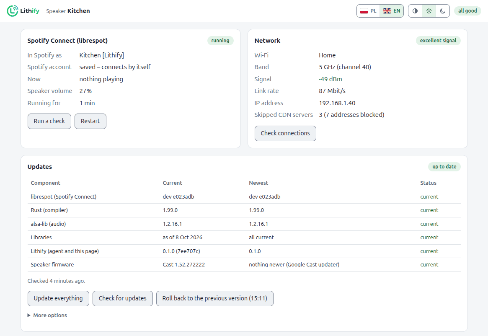
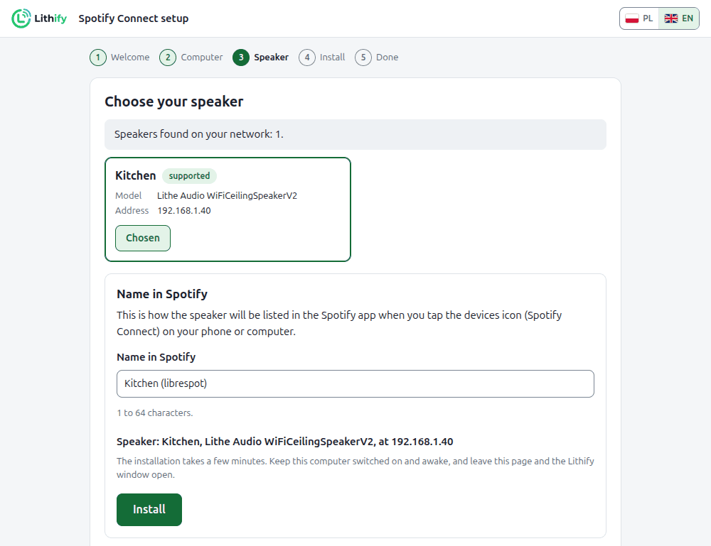
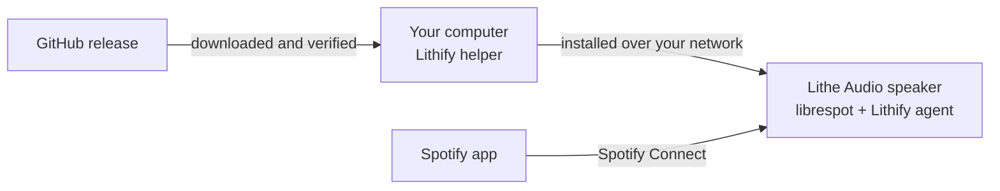

<div align="center">

<picture>
  <source media="(prefers-color-scheme: dark)" srcset="docs/images/logo-dark.svg">
  
</picture>

**Reliable Spotify Connect for Lithe Audio Wi-Fi speakers.**

[](https://github.com/OWNER/lithify/releases/latest)
[](https://github.com/OWNER/lithify/actions/workflows/ci.yml)
[](LICENSE)

[Install](#install) · [Features](#features) · [FAQ](#faq) · [Documentation](#documentation) · [Po polsku](docs/pl/README.md)

</div>

Lithify puts [librespot](https://github.com/librespot-org/librespot), the open-source Spotify
Connect client, on Lithe Audio ceiling speakers. It runs next to the speaker's own firmware and
installs from any computer in a few clicks. Nothing is flashed, and one command removes it.

<picture>
  <source media="(prefers-color-scheme: dark)" srcset="docs/images/speaker-page-dark.png">
  
</picture>

## Why

The Spotify client built into Lithe Audio's LS9 speakers dates from 2021, and their last firmware
came out in 2024. It starts a song and then plays nothing, lags on pause and skip, and can keep a
CPU core busy for days. Lithify gives each speaker a second, current Spotify Connect device that
just plays, and keeps it up to date.

## Features

- **Plays reliably.** librespot 0.8 with upstream fixes, built for the speaker's own Cortex-A7
  processor.
- **Real speaker volume.** The Spotify slider moves the same volume as Google Cast and AirPlay.
- **Nothing flashed.** Firmware, Cast, AirPlay and the official Spotify all stay.
  `lithify uninstall` restores the stock speaker.
- **A page on every speaker.** Status, settings, connection tests and logs at
  `http://<speaker>:8090`, in English and Polish.
- **One-click updates.** Your computer fetches each new release, and the speaker installs it,
  keeps its settings, and can roll back in one step.
- **A watchdog.** It revives the official Spotify client when it hangs, and lets Cast and AirPlay
  take over the speaker when they start.

## Install

You need:

- a [supported speaker](#supported-speakers);
- **Spotify Premium** (librespot does not work with free accounts);
- a Windows, macOS or Linux computer on the same network.

**Windows:** download [**Lithify-Windows.cmd**](https://github.com/OWNER/lithify/releases/latest/download/Lithify-Windows.cmd) and double-click it.

**macOS:** open Terminal and run:

```sh
curl -fsSL https://raw.githubusercontent.com/OWNER/lithify/main/installer/install.sh | sh
```

**Linux:** in a terminal, run:

```sh
wget -qO- https://raw.githubusercontent.com/OWNER/lithify/main/installer/install.sh | sh
```

The installer asks once before it changes anything, then opens the Lithify wizard in your
browser. The wizard finds the speaker by itself. Click **Install**, and a few minutes later pick
*Kitchen (librespot)* in Spotify's list of devices.

<picture>
  <source media="(prefers-color-scheme: dark)" srcset="docs/images/wizard-dark.png">
  
</picture>

<details>
<summary>Prompts you may see, and other ways to install</summary>

- **Windows** asks once whether to run the file: *Run*, or *More info → Run anyway*. It asks once
  more for permission to add a firewall rule, so the speaker can download its software from your
  computer: *Yes*. The same in PowerShell:
  `irm https://raw.githubusercontent.com/OWNER/lithify/main/installer/get.ps1 | iex`
- **macOS:** if its firewall is on, it asks whether Python may accept incoming connections:
  *Allow*. To install with a double-click instead, use **Lithify-macOS.zip** from the
  [latest release](https://github.com/OWNER/lithify/releases/latest).
- **Linux:** **Lithify-Linux.zip** from the release installs with a double-click too (on GNOME:
  right-click → *Run as a Program*). With ufw or firewalld on, the installer offers to open the
  ports the speaker uses.
- If the computer has no Python 3.11 or newer, the installer adds one for this user only, without
  administrator rights.

Everything the installer changes, its options, and the manual way:
[docs/installation.md](docs/installation.md).

</details>

## Supported speakers

| Platform | Lithe Audio models | Status |
|---|---|---|
| Libre LS9 | Wi-Fi Ceiling Speaker V2 (single and pair), WiFi PRO, Micro Subwoofer | supported |
| Libre LS10 | Wi-Fi Speaker V3, WiFi PRO 2, iO1 | not yet, see [platforms.md](docs/platforms.md) |

The wizard tells you whether a speaker is supported before it changes anything.

## How it works



Lithify adds two entries to the speaker's own service list: librespot, and a small agent that
runs the watchdog and the web page. Their files live in one folder on the speaker's persistent
storage. Your computer downloads each release, checks every file and hands it to the speaker over
your network, so the speaker never downloads its software from the internet itself. More in
[docs/architecture.md](docs/architecture.md).

## Updating

Click **Update everything** on the speaker's page, or run the installer again. Your computer
downloads the newest release. The speaker installs it only if it is newer, and keeps its settings.
**Roll back** returns to the previous version.

## FAQ

**Does it change the speaker's firmware?**\
No. Lithify adds one folder and two entries to the speaker's service list. Google Cast, AirPlay and
the official Spotify keep working, and `lithify uninstall` puts the speaker back as it was.

**Why does Spotify list my speaker twice?**\
One entry is the speaker's own Spotify client, the other is Lithify. You can hide the official one
on the speaker's page. It comes back by itself whenever librespot stops.

**Does my computer have to stay on?**\
Only during the installation and for updates. The speaker plays on its own.

**Where is my Spotify login?**\
You never type it into Lithify. The first time you pick the speaker in the Spotify app, Spotify
hands the speaker a login token, which the speaker keeps, like any Spotify Connect device.

**Is it safe?**\
The LS9 firmware has a root service console on TCP port 23, open without a password to anyone on
your network. Lithify uses that console to install, but it did not add it and cannot close it.
Keep the speakers on a network you trust, ideally a separate one for smart-home devices. Details in
[docs/security.md](docs/security.md).

## Documentation

- [Installation](docs/installation.md): prompts, what changes, options, uninstalling
- [Configuration](docs/configuration.md): every setting, `config.toml`, several speakers
- [Commands](docs/commands.md): the `lithify` command line
- [Troubleshooting](docs/troubleshooting.md): not in Spotify, no sound, stutter, the firewall
- [Security](docs/security.md): the speaker's console, the page's PIN, what runs where
- [Architecture](docs/architecture.md): how Lithify runs, builds and updates
- [Platforms](docs/platforms.md): LS9, LS10, and adding a platform

## Contributing

Bug reports and pull requests are welcome. Run the tests with
`python -m unittest discover -s tests -t .`, and the agent's with `cargo test` in `agent/`.
Please report security problems privately ([how](docs/security.md#reporting)).

## License

Lithify is MIT-licensed, see [LICENSE](LICENSE). It builds on
[librespot](https://github.com/librespot-org/librespot) (MIT) and alsa-lib (LGPL 2.1, linked
statically; its source is at [alsa-project.org](https://www.alsa-project.org), and the build
script reproduces the binary).

Lithify is an independent project, not affiliated with or endorsed by Lithe Audio, Libre Wireless,
Google or Spotify. Spotify is a trademark of Spotify AB.
