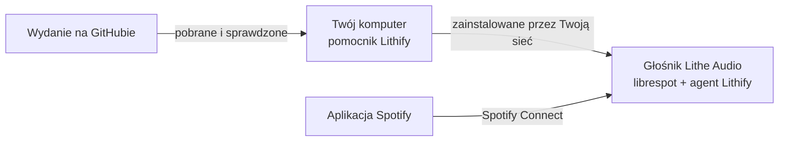

<div align="center">

<picture>
  <source media="(prefers-color-scheme: dark)" srcset="../images/logo-dark.svg">
  
</picture>

**Niezawodny Spotify Connect dla głośników Lithe Audio Wi-Fi.**

[Instalacja](#instalacja) · [Co dostajesz](#co-dostajesz) · [Pytania](#pytania) · [Dokumentacja](#dokumentacja) · [English](../../README.md)

</div>

Lithify instaluje na głośnikach sufitowych Lithe Audio [librespot](https://github.com/librespot-org/librespot),
otwartego klienta Spotify Connect. Działa obok oryginalnego oprogramowania głośnika i instaluje
się z dowolnego komputera w kilka kliknięć. Niczego nie flashuje, a jedno polecenie usuwa go w
całości.

<picture>
  <source media="(prefers-color-scheme: dark)" srcset="../images/speaker-page-pl-dark.png">
  
</picture>

## Po co

Klient Spotify wbudowany w głośniki Lithe Audio na platformie LS9 pochodzi z 2021 roku, a
ostatni firmware ukazał się w 2024. Potrafi zacząć utwór i nic nie zagrać, reaguje z opóźnieniem
na pauzę i przewijanie, a do tego potrafi przez wiele dni obciążać rdzeń procesora. Lithify daje
każdemu głośnikowi drugie, aktualne urządzenie Spotify Connect, które po prostu gra, i dba o jego
aktualizacje.

## Co dostajesz

- **Stabilne odtwarzanie.** librespot 0.8 z poprawkami z głównego projektu, zbudowany pod
  procesor głośnika (Cortex-A7).
- **Prawdziwa głośność.** Suwak w Spotify zmienia tę samą głośność co Google Cast i AirPlay.
- **Bez flashowania.** Firmware, Cast, AirPlay i oficjalny Spotify zostają. `lithify uninstall`
  przywraca fabryczny stan głośnika.
- **Strona na każdym głośniku.** Stan, ustawienia, testy połączeń i logi pod
  `http://<głośnik>:8090`, po polsku i po angielsku.
- **Aktualizacje jednym kliknięciem.** Komputer pobiera każde nowe wydanie, a głośnik je
  instaluje, zachowuje swoje ustawienia i w razie potrzeby wraca do poprzedniej wersji.
- **Strażnik.** Gdy oficjalny klient Spotify się zawiesza, uruchamia go ponownie, a gdy zaczyna
  grać Cast albo AirPlay, oddaje im głośnik.

## Instalacja

Potrzebujesz:

- [obsługiwanego głośnika](#obsługiwane-głośniki);
- konta **Spotify Premium** (librespot nie działa z darmowymi kontami);
- komputera z Windowsem, macOS albo Linuksem w tej samej sieci.

**Windows:** pobierz [**Lithify-Windows.cmd**](https://github.com/OWNER/lithify/releases/latest/download/Lithify-Windows.cmd) i kliknij go dwukrotnie.

**macOS:** otwórz Terminal i uruchom:

```sh
curl -fsSL https://raw.githubusercontent.com/OWNER/lithify/main/installer/install.sh | sh
```

**Linux:** w terminalu uruchom:

```sh
wget -qO- https://raw.githubusercontent.com/OWNER/lithify/main/installer/install.sh | sh
```

Instalator raz pyta, zanim cokolwiek zmieni, a potem otwiera w przeglądarce kreator Lithify.
Kreator sam znajduje głośnik. Kliknij **Zainstaluj**, a po kilku minutach wybierz
*Kuchnia (librespot)* z listy urządzeń w Spotify.

<picture>
  <source media="(prefers-color-scheme: dark)" srcset="../images/wizard-pl-dark.png">
  
</picture>

<details>
<summary>Pytania, które może zadać system, i inne sposoby instalacji</summary>

- **Windows** raz pyta, czy uruchomić plik: *Uruchom* albo *Więcej informacji → Uruchom mimo to*.
  Drugi raz prosi o zgodę na regułę zapory, żeby głośnik mógł pobrać oprogramowanie z komputera:
  *Tak*. To samo w PowerShellu:
  `irm https://raw.githubusercontent.com/OWNER/lithify/main/installer/get.ps1 | iex`
- **macOS:** jeśli zapora jest włączona, pyta, czy Python może przyjmować połączenia
  przychodzące: *Pozwól*. Instalacja dwuklikiem: **Lithify-macOS.zip** z
  [najnowszego wydania](https://github.com/OWNER/lithify/releases/latest).
- **Linux:** **Lithify-Linux.zip** z wydania też działa dwuklikiem (w GNOME: prawy przycisk →
  *Uruchom jako program*). Gdy działa ufw albo firewalld, instalator proponuje otwarcie portów,
  z których korzysta głośnik.
- Jeśli na komputerze nie ma Pythona 3.11 lub nowszego, instalator doda go tylko dla tego
  użytkownika, bez uprawnień administratora.

Wszystko, co instalator zmienia, jego opcje i instalacja ręczna (po angielsku):
[installation.md](../installation.md).

</details>

## Obsługiwane głośniki

| Platforma | Modele Lithe Audio | Stan |
|---|---|---|
| Libre LS9 | Wi-Fi Ceiling Speaker V2 (pojedynczy i para), WiFi PRO, Micro Subwoofer | obsługiwane |
| Libre LS10 | Wi-Fi Speaker V3, WiFi PRO 2, iO1 | jeszcze nie, zobacz [platforms.md](../platforms.md) |

Kreator mówi, czy głośnik jest obsługiwany, zanim cokolwiek zmieni.

## Jak to działa



Lithify dodaje dwa wpisy do listy usług głośnika: librespot oraz małego agenta, który prowadzi
strażnika i stronę WWW. Ich pliki leżą w jednym katalogu w trwałej pamięci głośnika. Twój
komputer pobiera każde wydanie, sprawdza każdy plik i przekazuje je głośnikowi przez sieć
lokalną, więc głośnik nigdy sam nie pobiera oprogramowania z internetu. Więcej (po angielsku):
[architecture.md](../architecture.md).

## Aktualizacje

Kliknij **Zaktualizuj wszystko** na stronie głośnika albo uruchom instalator ponownie. Komputer
pobiera najnowsze wydanie, a głośnik instaluje je tylko wtedy, gdy jest nowsze, i zachowuje swoje
ustawienia. **Przywróć poprzednią wersję** wraca do poprzedniej wersji.

## Pytania

**Czy Lithify zmienia firmware głośnika?**\
Nie. Dodaje jeden katalog i dwa wpisy na liście usług głośnika. Google Cast, AirPlay i oficjalny
Spotify działają dalej, a `lithify uninstall` przywraca głośnik do stanu sprzed instalacji.

**Dlaczego Spotify pokazuje głośnik dwa razy?**\
Jedna pozycja to wbudowany klient Spotify, druga to Lithify. Oficjalną możesz ukryć na stronie
głośnika. Wraca sama, gdy librespot przestaje działać.

**Czy komputer musi być cały czas włączony?**\
Tylko podczas instalacji i aktualizacji. Głośnik gra bez niego.

**Gdzie jest moje logowanie do Spotify?**\
Nigdzie go nie wpisujesz. Gdy pierwszy raz wybierzesz głośnik w aplikacji Spotify, Spotify
przekaże mu token logowania, który głośnik zachowa, jak każde urządzenie Spotify Connect.

**Czy to bezpieczne?**\
Firmware LS9 ma na porcie TCP 23 konsolę serwisową root dostępną bez hasła dla każdego w Twojej
sieci. Lithify używa jej do instalacji, ale jej nie dodał i nie może jej zamknąć. Trzymaj głośniki
w zaufanej sieci, najlepiej w osobnej sieci dla urządzeń smart home. Szczegóły (po angielsku):
[security.md](../security.md).

## Dokumentacja

Po angielsku:

- [Installation](../installation.md): pytania instalatora, co zmienia, opcje, odinstalowanie
- [Configuration](../configuration.md): wszystkie ustawienia, `config.toml`, kilka głośników
- [Commands](../commands.md): polecenie `lithify`
- [Troubleshooting](../troubleshooting.md): brak w Spotify, brak dźwięku, zacięcia, zapora
- [Security](../security.md): konsola głośnika, PIN strony, co działa gdzie
- [Architecture](../architecture.md): jak Lithify działa, buduje się i aktualizuje
- [Platforms](../platforms.md): LS9, LS10 i dodawanie platform

## Licencja

Lithify jest na licencji MIT, zobacz [LICENSE](../../LICENSE). Korzysta z
[librespot](https://github.com/librespot-org/librespot) (MIT) i alsa-lib (LGPL 2.1, linkowana
statycznie; źródła na [alsa-project.org](https://www.alsa-project.org), a skrypt budowania odtwarza
plik binarny).

Lithify to niezależny projekt, niezwiązany z Lithe Audio, Libre Wireless, Google ani Spotify i
nieautoryzowany przez nie. Spotify jest znakiem towarowym Spotify AB.
