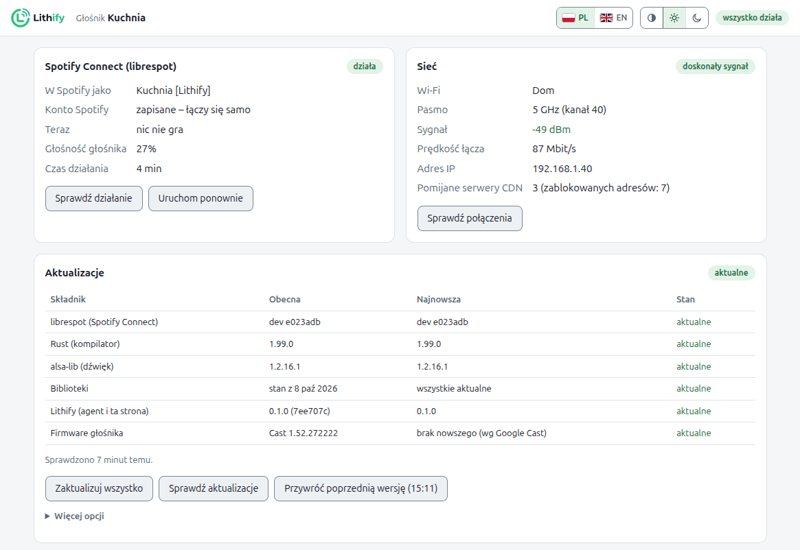
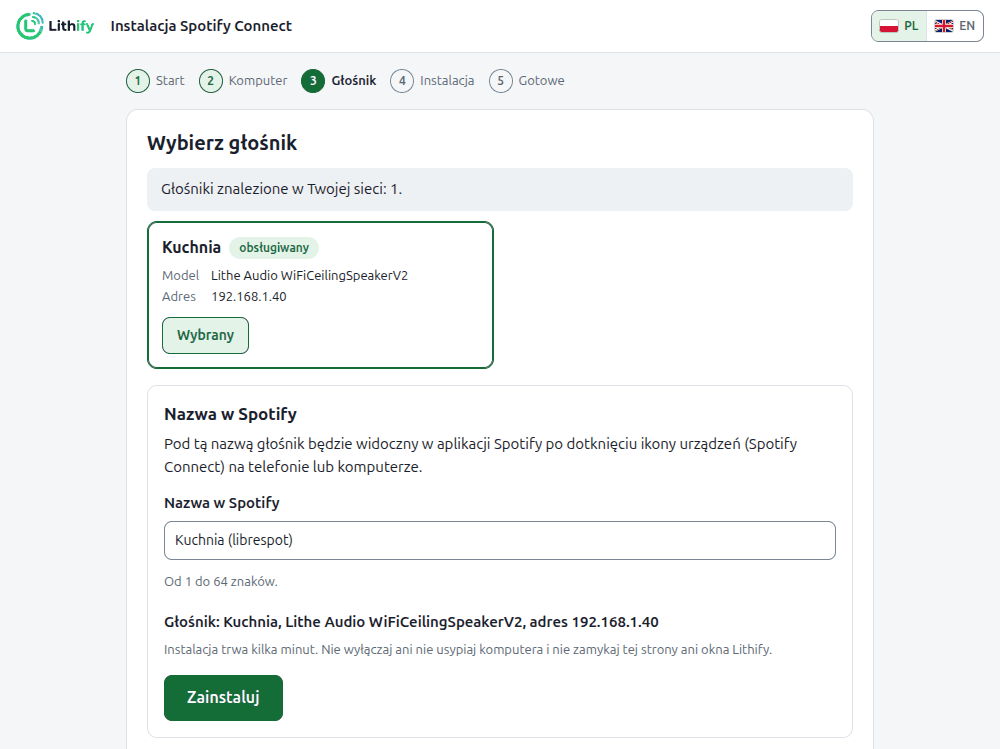

<div align="center">

<picture>
  <source media="(prefers-color-scheme: dark)" srcset="../images/logo-dark.svg">
  
</picture>

**Spotify Connect dla głośników Wi-Fi Lithe Audio, oparty na librespot.**

[Instalacja](#instalacja) · [Ograniczenia](#ograniczenia-i-ryzyko) · [Pytania](#pytania) · [Dokumentacja](#dokumentacja) · [English](../../README.md)

</div>

Lithify instaluje na głośnikach sufitowych Lithe Audio [librespot](https://github.com/librespot-org/librespot),
otwartego klienta Spotify Connect. Działa obok oprogramowania głośnika: firmware zostaje bez
zmian, a Google Cast, AirPlay i wbudowany Spotify działają dalej. Instalujesz go z komputera z
Windowsem, macOS albo Linuksem w tej samej sieci.

<picture>
  <source media="(prefers-color-scheme: dark)" srcset="../images/speaker-page-pl-dark.png">
  
</picture>

## Po co

Klient Spotify wbudowany w głośniki Lithe Audio na platformie LS9 pochodzi z 2021 roku, a
ostatnia aktualizacja firmware ukazała się w 2024. Na naszych głośnikach często zaczynał utwór i
nic nie grał, z opóźnieniem reagował na pauzę i przewijanie, a raz przez kilka dni obciążał rdzeń
procesora. librespot jest rozwijany i dostaje poprawki co kilka tygodni; Lithify instaluje go na
głośniku i dba o jego aktualizacje.

## Co dostajesz

- **Drugie urządzenie Spotify na każdym głośniku**, z librespot zbudowanym pod procesor głośnika.
- **Głośność samego głośnika.** Suwak w Spotify zmienia tę samą głośność co Google Cast i AirPlay.
- **Stronę WWW na każdym głośniku** pod `http://<głośnik>:8090`, po polsku i po angielsku: stan,
  ustawienia, testy połączeń, logi, aktualizacje i przywracanie poprzedniej wersji.
- **Aktualizacje jednym przyciskiem** na tej stronie albo przez ponowne uruchomienie instalatora.
  Gdy nowa wersja sprawia kłopoty, poprzednią przywrócisz jednym kliknięciem.
- **Opiekę nad wbudowanym Spotify.** Lithify uruchamia go ponownie, gdy się zawiesi albo padnie,
  i zatrzymuje librespot, gdy zaczyna grać Cast, AirPlay albo Bluetooth.

## Instalacja

Potrzebujesz:

- obsługiwanego głośnika, zobacz [Obsługiwane głośniki](#obsługiwane-głośniki);
- konta **Spotify Premium**, bo librespot nie działa z darmowymi kontami;
- komputera w tej samej sieci co głośnik: Windows 10 lub 11, macOS albo Linux.

**Windows:** pobierz [**Lithify-Windows.cmd**](https://github.com/TomaszKondraciuk/lithify/releases/latest/download/Lithify-Windows.cmd) i kliknij go dwukrotnie.

**macOS:** otwórz Terminal i uruchom:

```sh
curl -fsSL https://raw.githubusercontent.com/TomaszKondraciuk/lithify/main/installer/install.sh | sh
```

**Linux:** w terminalu uruchom:

```sh
wget -qO- https://raw.githubusercontent.com/TomaszKondraciuk/lithify/main/installer/install.sh | sh
```

Co dalej:

1. Instalator pokazuje, co doda do komputera, i raz prosi o zgodę.
2. Otwiera w przeglądarce kreator Lithify, który sam znajduje głośnik.
3. Klikasz **Zainstaluj**. Zwykle trwa to kilka minut; głośnik przez około minutę milczy, bo się
   uruchamia ponownie.

Jeśli komputer nie może pobrać gotowego wydania, instalator zbuduje Lithify sam. Potrzebny jest
wtedy Docker i około 4 GB wolnej pamięci, a pierwsze budowanie trwa do godziny.

<picture>
  <source media="(prefers-color-scheme: dark)" srcset="../images/wizard-pl-dark.png">
  
</picture>

**Sprawdź, czy działa:** otwórz Spotify na telefonie, dotknij ikony urządzeń i wybierz
*Kuchnia (librespot)*, czyli nazwę swojego głośnika z dopiskiem „(librespot)”. Nazwę zmienisz na
stronie głośnika w *Ustawieniach*.

<details>
<summary>Pytania systemu, przejrzenie skryptu i inne sposoby instalacji</summary>

- **Windows** raz pyta, czy uruchomić plik: kliknij *Uruchom* albo *Więcej informacji → Uruchom
  mimo to*. Potem prosi o zgodę na regułę zapory, żeby głośnik mógł pobrać oprogramowanie z
  komputera: kliknij *Tak*.
- **macOS:** jeśli zapora jest włączona, pyta, czy Python może przyjmować połączenia
  przychodzące: kliknij *Pozwól*. Instalacja dwuklikiem: **Lithify-macOS.zip** z
  [najnowszego wydania](https://github.com/TomaszKondraciuk/lithify/releases/latest).
- **Linux:** **Lithify-Linux.zip** z wydania też działa dwuklikiem. W GNOME kliknij plik prawym
  przyciskiem i wybierz *Uruchom jako program*. Gdy działa ufw albo firewalld, instalator
  proponuje otwarcie portów, z których korzysta głośnik.
- Jeśli na komputerze nie ma Pythona 3.11 lub nowszego, instalator doda go tylko dla Twojego
  użytkownika, bez uprawnień administratora.
- **Chcesz przejrzeć skrypt przed uruchomieniem?** Najpierw go pobierz
  (`curl -fsSLo install.sh https://raw.githubusercontent.com/TomaszKondraciuk/lithify/main/installer/install.sh`),
  przeczytaj, potem uruchom `sh install.sh`. Na Windowsie otwórz `Lithify-Windows.cmd` w
  edytorze tekstu.

Głośniki w osobnej sieci (VLAN), opcje instalatora i instalacja ręczna:
[installation.md](installation.md).

</details>

## Obsługiwane głośniki

| Platforma | Modele Lithe Audio | Stan |
|---|---|---|
| Libre LS9 | Wi-Fi Ceiling Speaker V2 | obsługiwany, sprawdzony na firmware p15525.144.0 |
| Libre LS9 | WiFi PRO, Micro Subwoofer, para Ceiling Speaker V2 | ta sama platforma, jeszcze nie sprawdzone |
| Libre LS10 | Wi-Fi Speaker V3, WiFi PRO 2, iO1 | nieobsługiwane, zobacz [platforms.md](../platforms.md) |

Kreator sprawdza głośnik, zanim cokolwiek zmieni, i przerywa, jeśli głośnik nie jest obsługiwany.

Sprawdzone komputery: Windows 11, macOS 15 i Ubuntu 24.04.

## Ograniczenia i ryzyko

- **Na własne ryzyko.** Lithify nie pochodzi od Lithe Audio i producent go nie wspiera. Zmiana
  oprogramowania głośnika może wpłynąć na wsparcie producenta. Nie ma żadnej gwarancji, zobacz
  [LICENSE](../../LICENSE).
- **Regulamin Spotify.** librespot to nieoficjalny klient. Spotify go nie popiera, a korzystanie z
  niego może naruszać regulamin Spotify.
- **Jedno źródło naraz.** Głośnik ma jedno wyjście audio. Gdy zaczyna grać Cast, AirPlay,
  Bluetooth albo wbudowany Spotify, librespot się zatrzymuje.
- **Bez multiroomu.** Urządzenie librespot nie wchodzi do grup głośników Google Cast. Spotify
  Connect gra na jednym urządzeniu naraz.
- **Aktualizacje wymagają komputera.** Głośnik gra bez niego, ale przyciski aktualizacji na
  stronie działają tylko wtedy, gdy na komputerze działa pomocnik Lithify. To mała usługa w tle,
  którą instaluje instalator.

## Jak to działa


Lithify dodaje dwie pozycje do listy programów, które głośnik uruchamia przy starcie. Jedna to
librespot. Druga to mały program, agent Lithify, który pilnuje działania Spotify i udostępnia
stronę WWW. Ich pliki leżą w jednym katalogu w trwałej pamięci głośnika.

Komputer pobiera każde wydanie z GitHuba i sprawdza każdy plik, zanim go użyje. Pomocnik kopiuje
potem pliki na głośnik przez Twoją sieć. Sam głośnik nigdy nie pobiera oprogramowania z internetu.

Więcej (po angielsku): [architecture.md](../architecture.md).

## Prywatność

Lithify nie wysyła żadnych statystyk. Komputer łączy się z GitHubem, żeby pobrać Lithify i jego
wydania. Tylko wtedy, gdy sam buduje Lithify, łączy się też ze stronami potrzebnymi do budowania,
na przykład crates.io i alsa-project.org. Głośnik łączy się ze Spotify, a w sprawie aktualizacji
z Twoim komputerem.

## Aktualizacja i usuwanie

- **Aktualizacja:** kliknij **Zaktualizuj wszystko** na stronie głośnika albo uruchom instalator
  ponownie. Głośnik instaluje wydanie tylko wtedy, gdy jest nowsze od tego, które ma, i zachowuje
  swoje ustawienia. Przyciskiem **Przywróć poprzednią wersję** cofniesz aktualizację.
- **Po aktualizacji firmware** głośnik może przestać uruchamiać Lithify. Uruchom instalator
  ponownie.
- **Usuwanie:** polecenie `lithify uninstall`, uruchomione na komputerze, przywraca fabryczne
  oprogramowanie głośnika i pyta, zanim uruchomi go ponownie. Jak usunąć Lithify także z
  komputera: [installation.md](installation.md#usuwanie).

## Pytania

**Czy Lithify zmienia firmware głośnika?**\
Nie. Dodaje jeden katalog i dwie pozycje do listy programów uruchamianych przy starcie. Google
Cast, AirPlay i wbudowany Spotify działają dalej.

**Dlaczego Spotify pokazuje głośnik dwa razy?**\
Jedna pozycja to wbudowany Spotify, druga to Lithify. Wbudowany możesz ukryć na stronie
głośnika. Jeśli librespot przestanie działać na około dwie minuty, wbudowany wróci jako zapas.

**Czy komputer musi być cały czas włączony?**\
Nie, tylko podczas instalacji i aktualizacji. Głośnik gra bez niego.

**Gdzie jest moje logowanie do Spotify?**\
Nigdzie go nie wpisujesz. Gdy pierwszy raz wybierzesz głośnik w aplikacji Spotify, Spotify
przekaże mu token logowania, który głośnik zachowa, żeby po ponownym uruchomieniu łączyć się sam.
Żeby go usunąć, wyloguj wszystkie urządzenia w ustawieniach konta Spotify.

**Gdzie szukać pomocy?**\
Zajrzyj do [troubleshooting.md](troubleshooting.md), potem przejrzyj istniejące zgłoszenia. Jeśli
nic nie pasuje, załóż nowe i dołącz wynik `lithify status`.

## Dokumentacja

- [Instalacja](installation.md): pytania instalatora, wymagania sieciowe, opcje, usuwanie
- [Rozwiązywanie problemów](troubleshooting.md): głośnik nie znaleziony, brak w Spotify, brak dźwięku, zacięcia

Po angielsku:

- [Configuration](../configuration.md): wszystkie ustawienia, `config.toml`, kilka głośników
- [Commands](../commands.md): polecenie `lithify`
- [Architecture](../architecture.md): jak Lithify działa, buduje się i aktualizuje
- [Platforms](../platforms.md): LS9, LS10 i dodawanie platform

## Współpraca

Zgłoszenia błędów i pull requesty są mile widziane, zobacz [CONTRIBUTING](../../.github/CONTRIBUTING.md)
(po angielsku).

Lithify jest darmowy i taki sam dla wszystkich. Jeśli Ci pomaga, możesz go wesprzeć dobrowolną
darowizną przez [GitHub Sponsors](https://github.com/sponsors/TomaszKondraciuk).

## Licencja

Lithify jest na licencji MIT, zobacz [LICENSE](../../LICENSE). Korzysta z
[librespot](https://github.com/librespot-org/librespot) (MIT) i alsa-lib (LGPL 2.1, linkowana
statycznie; źródła na [alsa-project.org](https://www.alsa-project.org), a skrypt budowania odtwarza
plik binarny).

Lithify to niezależny projekt, niezwiązany z Lithe Audio, Libre Wireless, Google ani Spotify i
przez nie nieautoryzowany. Spotify jest znakiem towarowym Spotify AB.
